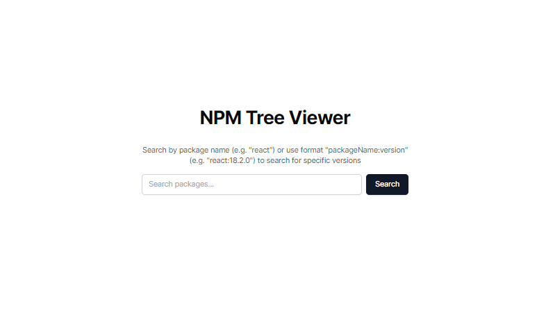
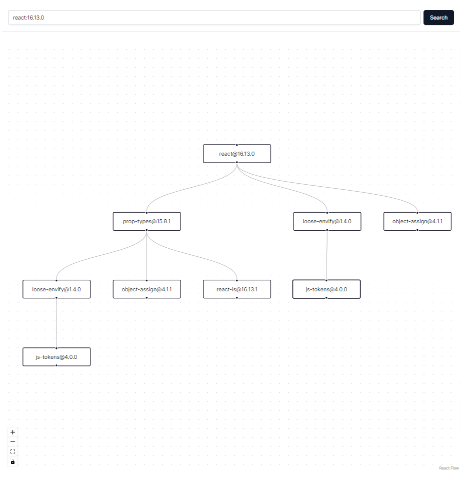

# NPM Tree Viewer

## Overview

The NPM Tree Viewer is a web application that allows you to visualise the dependency tree of an NPM package. It provides a visual representation of the package's dependencies and their relationships, making it easier to understand the structure and dependencies of a package.

## Video Demo

## How to use

1. Search for a package by name or use the format "packageName:version" to search for a specific version.
2. The application will display the dependency tree of the package, showing the relationships between the packages.

## How it works
The application consists of a backend built with Express.js that provides an API endpoint `/package/:name/:version?` to fetch dependency information from NPM. The frontend, built with React, makes requests to this endpoint and uses the react-flow library to create an interactive visualization of the dependency tree.

## Author
Muneeb Rehman
